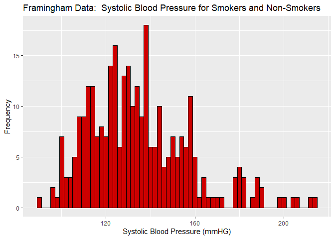
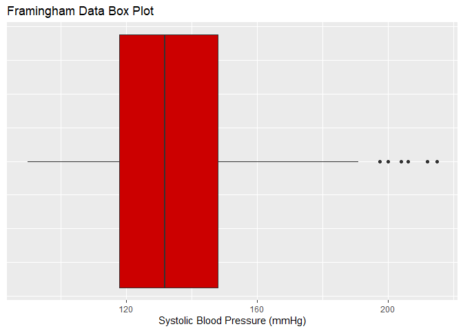
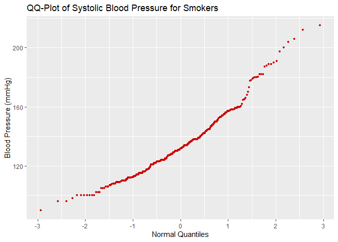

Hypothesis Testing for the difference in means using the p-value and
confidence interval methods of evaluation of a t-test
================
Brock Akerman and Hanan Ali
ST502 - Spring 2022

A sample of data is extracted from the Framingham Heart Study which
includes the systolic blood pressure of participants who are identified
as either smokers or non-smokers. Smokers in this study are defined as
participants who have smoked cigarettes anytime the year preceding the
physical examination while non-smokers are those who have abstained from
smoking during that same period of time. (SOURCE:
<https://www.ncbi.nlm.nih.gov/pmc/articles/PMC6541867/>). The data
contains a column of qualitative binary values characterizing the
subjects smoking habit and a second column pairing it with a single
measurement of systolic blood pressure measured in millimeters of
mercury (mmHg).

We are interested in examining the difference in blood pressure means
between smokers and non-smokers. To test whether a difference between
means exists, we will use the t-test (pooled) the Welch-Satterthwaite
t-test. Random sampling and a normal distribution are assumed for each
of the sample; however let us examine some plots to better understand
the data visually and reinforce the normality assumption.  
  

From the sample of systolic blood pressures we can see a skew toward the
right. There is concern for outliers influencing this skew. Of
particular concern is the systolic blood pressure for the observations
where the subject had a 200 mmHg reading. A pressure observed above
180mmHg is consider a medical emergency and requires urgent care and
hospitalization. A test for outliers is recommended. Should there be
justification for removing the observations above 180mmHg, this
distribution would appear to closely resemble a normal.  
  
  
  
A generated boxplot of the sampled data shows six outliers which aligns
with analysis of the histogram and the skew. These data points should be
removed since they deviate from the remaining data points; in reality
these are subjects that either should be hospitalized or the testing
methods should be reevaluated in case this is a user generated error by
the clinician administering the test.  
  
  

Our Quantile-Quantile plot illustrates a linear arrangement. Both tails
deviate from that line but not so close to the center of the data that I
would be concerned in rejecting the normality assumption. Potential
outliers are present in the upper blood pressure range. The same six
data points observed in the histogram are causing the upper tail of the
distribution to deviate from this line. Positively identifying and
removing outliers in the upper tail will result in a better normality
shape.  
  

# t-test (pooled)

###### **P-Value method**

Are the mean systolic blood pressures different between smokers and
non-smokers? We will use the t-test in our hypothesis test to answer
that question. First, we will consider the case of equal variance. The
status quo is that the mean systolic blood pressures are equal between
smokers and non-smokers. We would like to test whether there is evidence
to support the claim against the status quo–that there does exist a
difference between means.  
  
  
,
There is no difference between means of smokers and non-smokers.  
,
There is a difference between means of smokers and non-smokers.  
  
  

``` r
Y1 = framingham_data[currentSmoker==0,2] #Groups non-smokers
Y2 = framingham_data[currentSmoker==1,2] #Groups smokers

Y1 = unlist(framingham_data[currentSmoker==0,2])
barY1 = mean(Y1) #R code for computing systolic blood pressure mean for non-smokers

Y2 = unlist(framingham_data[currentSmoker==1,2])
barY2 = mean(Y2) #R code for computing systolic blood pressure mean for smokers
```

  
  
 = 137.22444")  
 = 128.06667")  
  
  

``` r
S1 = sd(Y1) #computing systolic blood pressure standard deviation for non smokers
S2 = sd(Y2) #computing systolic blood pressure standard deviation for smokers

n1= length(Y1) #number of non smokers
n2= length(Y2) #number of smokers
```

  
  
 = 352.2117")  
  
 = 18.76730")  
  
 = 562.1447")  
  
 = 23.70959")  
  
  

``` r
Sp2 = ((n1-1)*S1^2 + (n2-1)*S2^2)/(n1+n2-2)
```

S^2_{1}+(n_{2}-1)S^2_{2}}{n_{1}+n_{2}-2} = \frac{(225-1)352.2117+(75-1)562.1447}{225+75-2}")

``` r
T1 = (barY1-barY2)/(sqrt(Sp2)*sqrt(1/n1 + 1/n2))
```

\#p-value 2\*(1-pt(3.04,298)) qt(0.025,298)

    We reject H0.  There is sufficient evidence to support the claim that mean systolic blood pressure between smokers and non-smokers differs at a significant level of 0.05.  

    ###### Confidence Interval method

    ```r
    #Computing confidence interval 
    (barY1 - barY2) - (qt(0.025,298))*(sqrt(Sp2)*sqrt(1/n1 + 1/n2))

    ## [1] 15.08355

``` r
#0.025 = alpha/2 and df=298
(barY1 - barY2) + (qt(0.025,298))*(sqrt(Sp2)*sqrt(1/n1 + 1/n2))
```

    ## [1] 3.232003

### t-test (Welch-Satterthwaite)

###### P-Value method

For the Welch-Satterthwaite t-test we will test using the same
hypothesis as in the t-test pooled; however, with the assumption about
the variance removed, the test statistic formula.

H0:μ1-μ2=0, There is no difference between means of smokers and
non-smokers.  
H1:μ1-μ2≠0, There is a difference between means of smokers and
non-smokers.

``` satterthwaite
<INSERT CODE CHUNK OF RESULTS FROM THE SATTERTHWAITE T-TEST>
```

We reject H0. There is sufficient evidence to support the claim that
mean systolic blood pressure between smokers and non-smokers differs at
a significant level of 0.05.

###### Confidence Interval method

### comparison of tests

Both test rejected the null hypothesis.

### concluding remarks
